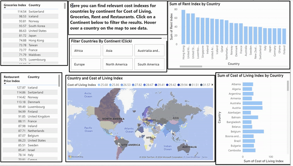

# Personalised Vacation Planner: Data-Driven Travel Recommendations
## Overview
This project is an assignment given by our client, IBM, with the objective of developing a personalised vacation planner that provides data-driven travel recommendations. The goal is to offer users insights into travel destinations, accommodations, activities, and real-time weather updates while prioritizing environmentally responsible and sustainable travel choices.

## Presentation
https://1drv.ms/p/s!AmD3W8lLA82JeXRzKM--BJ_jZ9Y?e=xHHc1T

## Cost DashBoard

## Features
Personalised Vacation Planning: Users receive tailored vacation recommendations based on their preferences, including travel activities, budget range, and climate preferences.
Optimised Budgeting: Budget-conscious travelers can plan their vacations within their financial constraints.
Real-time Updates: Users stay informed with real-time weather updates and event information for their selected destinations.
Environmental Impact Awareness: Users can make informed decisions regarding their carbon footprint by considering travel options and accommodation choices.
Interactive Travel Itinerary: An interactive user interface displays recommended travel itineraries, allowing users to customize and modify based on their preferences.
Recommendations and Suggestions: Data-driven algorithms recommend travel destinations, accommodations, and activities based on user preferences, travel trends, and current events.
Carbon Footprint Calculation: Integration of carbon footprint data enables users to understand the environmental impact associated with their travel choices.
## Getting Started
To get started with the Personalised Vacation Planner, We followed these steps:

Data Collection and Storage: Ingested open data from various sources, including tourism boards, weather services, accommodation databases, and event calendars. Stored the data in a database of your choice.
Data Cleaning and Pre-processing: Cleaned and pre-processed the raw data to handle inconsistencies and ensure data quality. After this we transformed data into a standardized format suitable for analysis.
Data Analysis: Performed data analysis to understand the distribution of data, identify patterns, and uncover insights. We also Visualized key metrics such as popular travel destinations, seasonal variations, and event frequencies.
Recommendations and Suggestions: Utilized data-driven algorithms to recommend travel destinations, accommodations, and activities based on user preferences and travel trends.
Real-time Weather Updates: Integrate a weather API to provide users with real-time weather updates for their selected travel dates and destinations.
Carbon Footprint Calculation: Source carbon footprint data to enable users to understand the environmental impact associated with their travel choices.

## Report
https://1drv.ms/w/c/6baa9301134f8010/EVA4z0GkAvNPpUU3B4xXXfYBWKs2yXi6nBPolGqaUURKLQ?e=RKcxJb

## Contact Information
For any question or inquiries,  please contact Japhetwolde@gmail.com

## Acknowledgements
I would like to acknowledge the support of IBM for their dedication to creating innovations that matter for the world. This project was developed as part of Skills City, with contributions from

Roberta Johnson

David Shefilled

Swati Patil

Evante

Muhammed Hamza Ali
